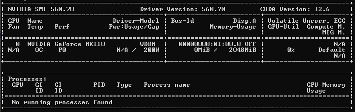

# Setup & compilation
## Initial setup (Windows 10)
Firstly, you should to find out the maximum supported version of CUDA on your computer. You can do this using the command:
`nvidia-smi`  
As you can see, you can use up to version 12.6 on my computer, but I installed an earlier version 11.8 to avoid problems of new versions:                                      

You also need to check that you haven't installed CUDA yet:
`nvcc --version`
it should show that it was not installed where.
To successfully install CUDA, you should also take care of the Visual Studio installed, along with the c++ development tools.
Now you can start installing all the necessary software to work with CUDA:
1. Download the required version of the CUDA Toolkit according to the one that was found out at the beginning:
`https://developer.nvidia.com/cuda-toolkit-archive`
2. Download cuDNN:
`https://developer.nvidia.com/cudnn`
3. After downloading these programs, install them.
4. Download NVIDIA Nsight Integration:
`https://developer.nvidia.com/nsight-tools-visual-studio-integration`
and and the other three necessary programs:
`https://developer.nvidia.com/nsight-compute`
`https://developer.nvidia.com/nsight-graphics`
`https://developer.nvidia.com/nsight-systems`
5. Now it's time to install it all.
6. If you did not change the standard installation paths, then by default everything should have been installed in the Program Files folder. Now you need to add these paths to the Path variables:
```
C:\Program Files\NVIDIA GPU Computing Toolkit\CUDA\v11.8
C:\Program Files\NVIDIA GPU Computing Toolkit\CUDA\v11.8\bin
C:\Program Files\NVIDIA GPU Computing Toolkit\CUDA\v11.8\include
C:\Program Files\NVIDIA GPU Computing Toolkit\CUDA\v11.8\lib
C:\Program Files\NVIDIA GPU Computing Toolkit\CUDA\v11.8\lib\x64
```
7. It is also worth creating a new CUDNN system variable and writing path data to it through the ";" sign.
8. Now is the time to check the installation is correct. A file was written for this purpose check_CUDA.cu . Compile it using the command:
`nvcc -arch=sm_50 -o check_CUDA check_CUDA.cu -allow-unsupported-compiler`
(change the -arch value according to the architecture of your graphics card)
And if everything goes well, then when you run the executable file, a message should be displayed: `Test PASSED`
9. To further work with the graphical representation of fractals, you need to install the SFML library:
`https://www.sfml-dev.org/download/sfml/2.6.1/`
(as you can see, this project uses version 2.6.1, but if necessary, you can install an earlier one, the main thing is that it matches your architecture and contains .lib files (version for Visual Studio))
10. After downloading, unzip the library to the desired folder and add to the PATH the path to its binary files, which are located inside this library in the /bin folder.
## After installing all the necessary toolkits and libraries
Now you can compile .cu files. To do this, you need to know the paths to the libraries. For example, here's what the compilation looks like on my computer:
```
nvcc -o Mandelbrot_CUDA Mandelbrot_CUDA.cu -I"C:/SFML/SFML-2.6.1_VS_64/include" -L"C:/SFML/SFML-2.6.1_VS_64/lib" -lsfml-graphics -lsfml-window -lsfml-system --allow-unsupported-compiler --expt-relaxed-constexpr -arch=sm_50
```
To compile regular .cpp files, you can use any of your favorite c++ compiler and link libraries in the same way.

## Compilation
You can compile the entire project using the command (specify the paths to the SFML library according to your installation):
```
nvcc -o fractal_CUDA src/main.cu src/general.cu src/Mandelbrot.cu src/Burning_ship.cu src/Sierpinski.cu src/Koch.cu src/Julia.cu -I./include -I"C:/SFML/SFML-2.6.1_VS_64/include" -L"C:/SFML/SFML-2.6.1_VS_64/lib" -lsfml-graphics -lsfml-window -lsfml-system --allow-unsupported-compiler --expt-relaxed-constexpr -arch=sm_50
```
To generate various fractals, it is enough to uncomment the necessary lines of draw functions in the `main.cu` code.